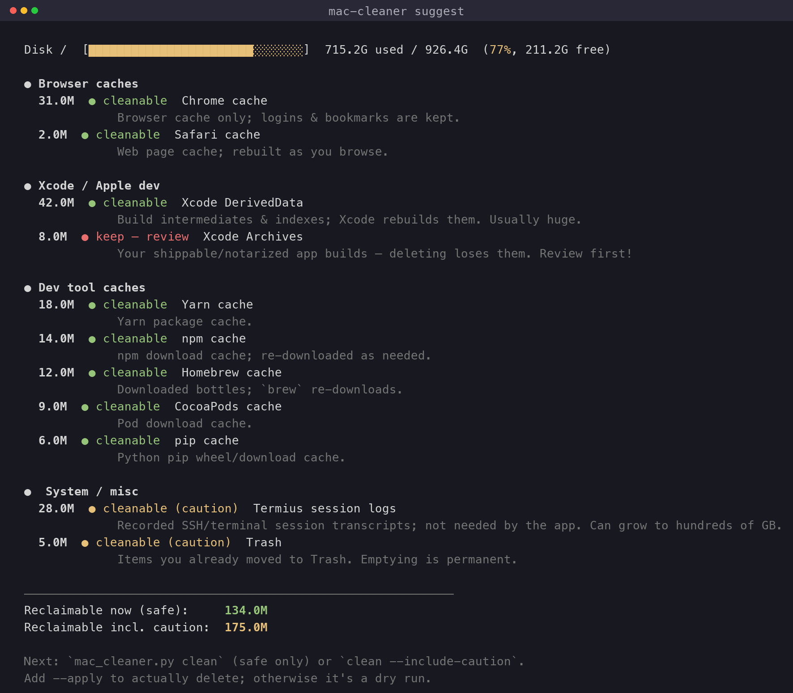
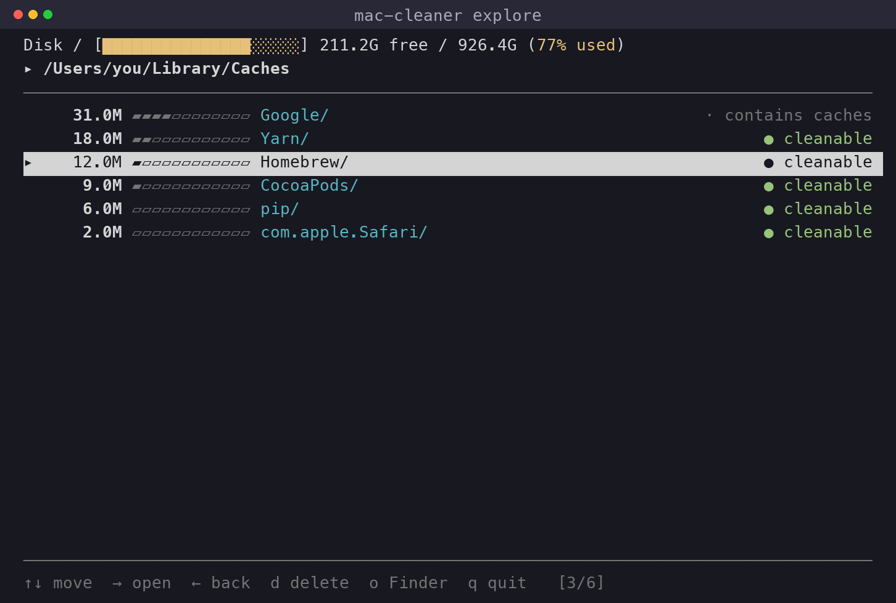
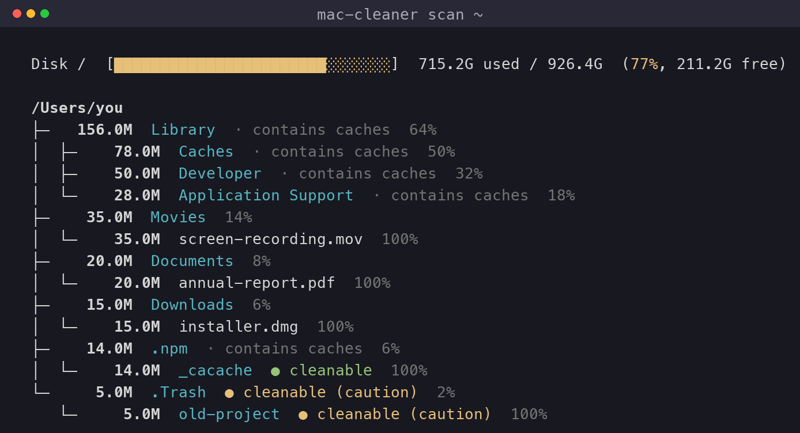

# mac-cleaner

A small, **dependency-free** (Python 3 stdlib only) CLI to find what's eating
your Mac's disk and safely reclaim space. No installs needed — important when
your disk is already full.

- 🔎 **See where the space goes** — sized folder tree, biggest first, level by level
- 🧭 **Finder-style browser** — arrow keys to drill in, no typing
- 🏷️ **Know what's safe** — every item tagged cleanable / caution / keep
- 🧹 **One-command cleanup** — browser, Xcode & dev-tool caches, dry-run by default



## Screenshots

**`explore` — Finder-style navigator (arrow keys, live sizes, safety tags)**



**`scan` — sized tree, level by level**



## Install

Pick whichever fits. The first needs **no build, no network, no extra disk
space** — best when your disk is already full.

```bash
# A) Symlink installer (recommended) — creates the `mac-cleaner` command
./install.sh
mac-cleaner suggest          # if ~/.local/bin is on your PATH (installer tells you)

# B) pipx — isolated install
pipx install .

# C) pip
pip install .

# D) No install at all — just run the script
python3 mac_cleaner.py suggest
```

After A/B/C you have a real `mac-cleaner` command on your PATH.

## Quick start

```bash
# 1. See what you could safely reclaim right now
mac-cleaner suggest

# 2. Find your biggest folders, level by level
mac-cleaner scan ~ --depth 2

# 3. Drill in interactively and delete from there
mac-cleaner explore ~

# 4. One-click cleanup of safe caches (dry-run first!)
mac-cleaner clean            # preview only
mac-cleaner clean --apply    # actually delete
```

(Not installed yet? Replace `mac-cleaner` with `python3 mac_cleaner.py`.)

## Commands

### `scan [path] [--depth N] [--top N] [--min-size 100M]`
Prints a sized, sorted tree — biggest first — so you can see, level by level,
where the space goes. Each item is tagged:

| tag | meaning |
|-----|---------|
| `● cleanable` (green) | known cache, safe to delete — regenerates automatically |
| `● cleanable (caution)` (yellow) | safe-ish, but may need re-download / lose state |
| `● keep — review` (red) | could lose real work (e.g. Xcode Archives) |
| `· contains caches` | folder holds cleanable caches deeper inside |
| `· likely cache` | lives in a `Caches/` dir — probably disposable, your call |

### `explore [path]`
A **Finder-style, full-screen navigator** — no typing, just arrow keys. The
currently selected row is highlighted; sizes are shown as bars so the space hogs
stand out, and each row carries the same cleanable/keep tags as `scan`.

| key | action |
|-----|--------|
| `↑` / `↓` (or `k` / `j`) | move the selection |
| `→` / `Enter` (or `l`) | open the selected folder |
| `←` (or `h` / `Backspace`) | go back up to the parent |
| `g` / `G` | jump to top / bottom |
| `d` | delete the selected item (asks `y` to confirm) |
| `o` | reveal it in Finder |
| `q` / `Esc` | quit |

### `suggest [categories...]`
Scans known cache locations (browsers, Xcode, dev tools, system) and reports how
much you can reclaim, split into "safe" vs "incl. caution". Read-only.

### `clean [categories...] [--apply] [--include-caution] [-y]`
Deletes known-safe caches. **Defaults to a dry-run** — it shows exactly what it
would remove and the total, and deletes nothing until you add `--apply`. With
`--apply` it still asks for confirmation unless you pass `-y`.

Categories: `browser` `xcode` `dev` `system`. Omit to clean all categories.

```bash
mac-cleaner clean xcode dev --apply     # only those two groups
mac-cleaner clean --include-caution --apply
```

## What it cleans

- **Browsers** (cache only — history, passwords, bookmarks are left alone):
  Safari, Chrome, Edge, Brave, Firefox, Arc.
- **Xcode / Apple dev**: DerivedData, build caches, Swift Package cache,
  CoreSimulator caches; *(caution)* device support symbols.
  Xcode **Archives are never auto-cleaned** — they're your shippable builds.
- **Dev tools**: npm, Yarn, pip, Homebrew, CocoaPods, Go build cache, Carthage;
  *(caution)* pnpm store, Go module cache, Gradle, Cargo caches.
- **System**: *(caution)* Trash, user logs.

## Safety

- Nothing is deleted without `--apply` **and** a confirmation prompt (or `-y`).
- Refuses to touch protected paths (`/`, `/System`, your home dir, etc.).
- Deletions are **permanent** (not moved to Trash) — that's the point, since a
  full disk means Trash wouldn't free anything until emptied anyway.
- The whole `~/Library/Caches` folder is *not* wiped wholesale: some apps store
  real data there. Unknown items are only flagged `likely cache` for you to judge
  in `explore`.

Sizes reflect actual allocated disk blocks (what you'll really get back).
